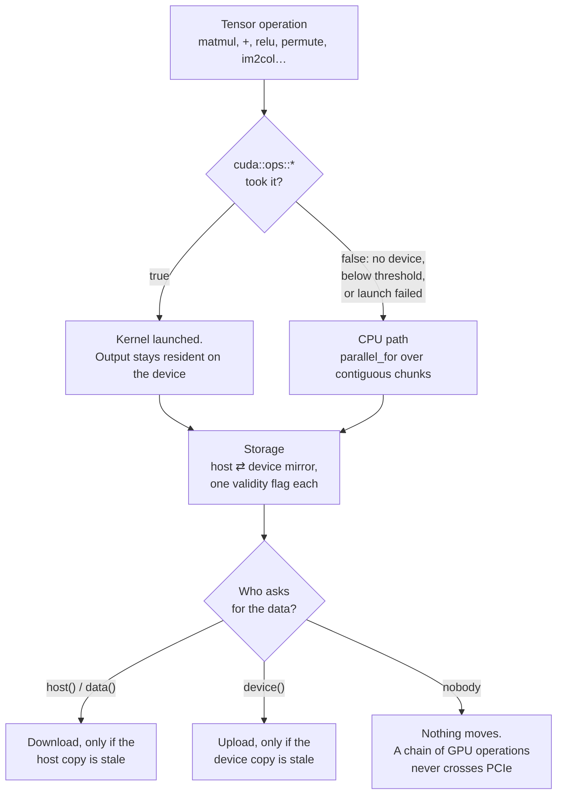
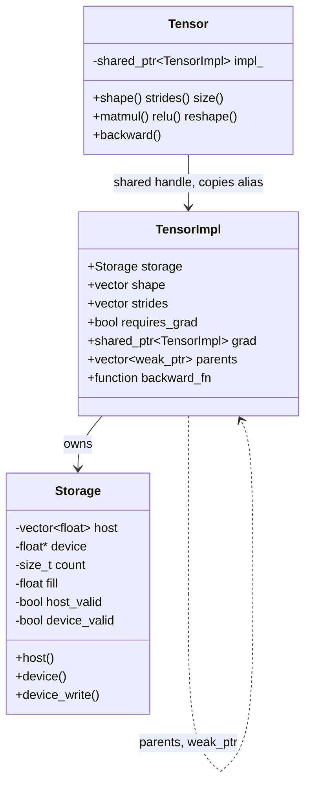

# cpp-ai-engine

A deep learning engine written from scratch in C++17 — tensors, reverse-mode
autodiff, CNNs and Transformers — with **every gradient validated against
PyTorch**.

[](https://github.com/DanielPastor05/cpp-ai-engine/actions/workflows/ci.yml)
[](https://danielpastor05.github.io/cpp-ai-engine/)


No dependencies. No BLAS. The point is to implement it, not to call it.

*Built with heavy AI assistance — [what that means, and what was mine](#how-this-was-built).*

*[Versión en español](README.es.md)*

---

## Results

| Task | This engine | Baseline | Note |
|---|---|---|---|
| **MNIST** (CNN, 60k images) | **99.35%** | — | real data, 6 epochs, ~10 min on one core |
| Shapes at random positions | **100%** (CNN, 1 683 params) | 73.3% (MLP, 1 779 params) | translation invariance |
| Interleaved 3-class spiral | **99.3%** (MLP) | 52.7% (linear) | non-linear separability |
| "Token after the marker" | **99.3%** (Transformer) | 17.5% (mean pooling) | chance is 16.7% |
| **Gradient agreement with PyTorch** | **~1e-7** | — | 23 fixtures, single ops to full blocks |
| MNIST training on 4 cores | **1.78×** (329 s vs 587 s) | 1 core | identical loss to the last digit |
| MNIST training on the GPU | **6.03×** (4.0 s vs 24.1 s) | same binary, CUDA off | RTX 3060 Ti, 2k subset, same loss curve, stock settings |
| The same run against PyTorch | **1.90× slower** (4.0 s vs 2.1 s) | PyTorch 2.11 + cuDNN, same card | fp32 both sides, TF32 off; [why](docs/PERFORMANCE.md#against-pytorch-on-the-same-card-which-is-the-number-that-counts) |
| …and on the CPU | 4.55× slower (24.1 s vs 5.3 s) | PyTorch on oneDNN | no BLAS here, by design — and on 12 threads against its 6 |
| matmul 512³ on 4 cores | **3.08×** | 1 core | bit-identical regardless of thread count |

Each baseline is a control that *provably cannot* solve its task. If one ever
starts succeeding, the experiment is broken — not the model.

<picture>
  <source media="(prefers-color-scheme: dark)" srcset="docs/img/mnist-vs-pytorch-dark.svg">
  
</picture>

**The engine loses to PyTorch, and that is the number worth publishing.** "5.5×
faster on the GPU than on the CPU" does not say the GPU path is fast — it says
the CPU path is slow. Measured against a framework anyone can install, on the
same card and the same model: 1.90× behind, and
[docs/PERFORMANCE.md](docs/PERFORMANCE.md#against-pytorch-on-the-same-card-which-is-the-number-that-counts)
takes the gap apart with a profiler. About half of it is cuDNN choosing Winograd
for the 3×3 convolutions, which is an algorithm this engine does not implement.

---

## What makes this different

**Gradients are validated against PyTorch, not just against themselves.**
Numerical gradient checking proves internal consistency; it does not catch a
convention that is wrong in both the forward and the backward pass.
`tools/generate_reference.py` builds the same computation in PyTorch, dumps
inputs, weights, outputs and gradients into the engine's own binary format, and
`tests/test_reference.cpp` replays them. Coverage runs from `matmul` up to a
complete `TransformerBlock` with all 16 of its parameters, and a 10-step Adam
trajectory. Everything agrees to ~1e-7. The fixtures are committed, so CI checks
them without needing Python.

**Performance work is measured, and the measurements sometimes disagreed with
me.** A micro-benchmark said removing a branch from `matmul` would give 1.7×;
removing it made the Transformer 12% *slower*, because the matrices reaching it
are ReLU outputs that are half zeros. Both results are in
[docs/PERFORMANCE.md](docs/PERFORMANCE.md), including the optimisations I
measured and discarded.

**Multi-threading that does not change the answer.** `matmul` and the
element-wise operators split across a persistent thread pool, and the split is
by output row — so the accumulation order never changes and results are
**identical bit for bit** whatever the thread count. The first attempt at this
made the examples *slower*; the thresholds are derived from a measured 7.8 µs
dispatch cost. Set with `ENGINE_NUM_THREADS` or `parallel::set_num_threads`.

**A GPU backend that does not fork the codebase.** Every CUDA operation returns
a `bool` — *true if it took the work*. False means no device, or a size where
the GPU would lose to one CPU core, and the caller falls through to the existing
path. So `src/tensor.cpp` gained one condition per operation, not a second
implementation. `Storage` keeps a host buffer and a lazily-synced device mirror,
so a chain of operations stays on the GPU and only comes back when the program
reads a value — asserted by counting transfers, not assumed.
[docs/CUDA.md](docs/CUDA.md).

**Real bugs, found and fixed.** A `shared_ptr` cycle that leaked the entire
computation graph. A repeated `backward()` that multiplied gradients. A heap
overflow that AddressSanitizer caught and every test missed. Each is written up
with symptom, diagnosis and fix in [docs/ENGINEERING.md](docs/ENGINEERING.md),
and each has a regression test.

---

## Quick start

```bash
cmake --preset default && cmake --build --preset default
ctest --preset default                         # 530 checks
./build/mnist_demo                             # trains a CNN on real data
```

`CMakePresets.json` also carries `cuda`, `debug`, `asan` and `tsan` — the five
configurations CI builds, so reproducing a red job is one flag rather than a
remembered command line. `cmake --list-presets` shows them.

The repository ships a 2 000-image MNIST subset so this works straight after
cloning. Run `tools/download_mnist.sh` for the full 60 000 — the example detects
which one is present.

---

## What's inside

Every operation goes through one dispatch decision, and that decision is the
architecture. `cuda::ops::*` returns `bool`: **true means the device took the
work**, false sends the caller down the CPU path. There is no `#ifdef` per
operation and no second implementation to keep in sync — without CUDA the same
functions are linked from `src/cuda_disabled.cpp` returning false, and the
linker deletes them.



The invariant that makes it work: **at least one of the two copies is valid at
all times**, and nothing is transferred until somebody asks for the side that
has gone stale. That is why a `conv → relu → pool → conv` chain stays on the
card end to end, and why an operation *without* a kernel is expensive out of
proportion to its cost — it pulls its input down and forces the next one to push
it back up.

### What a tensor is made of

Four types, and the split between them is the decision the rest of the engine
rests on. `Storage` exists as its own type **because it was separated before the
first kernel was written** — with a `std::vector<float>` inside `TensorImpl`
there would have been nowhere to record that a tensor was already on the card,
and every operation would have grown host/device branches.



Three things this picture is the shortest way to say:

**`Tensor` is a handle.** Copying one shares the data, the gradient and the
history. That is what lets a `backward_fn` capture its inputs by value without
copying a megabyte, and it is why `Storage`'s copy constructor deep-copies while
sharing has to be asked for by name — a captured input that changed under a
closure would be a very quiet bug.

**The parent edges are `weak_ptr`.** A graph node holds its parents, and a
parameter holds its gradient, which holds the node that produced it: a cycle,
and one that leaked the entire computation graph until it was found. The write-up
is in [docs/ENGINEERING.md](docs/ENGINEERING.md).

**`Storage` describes its buffer before it allocates it.** `count` and `fill`
say what the values are; the host vector is built on first host access and the
device pointer on first device use. A tensor that only ever passes through
kernels allocates no host memory at all — which was worth 20 ms of a 32 ms
training step.

[**API reference**](https://danielpastor05.github.io/cpp-ai-engine/), generated
from these headers on every push to `main`.

```
include/engine/
  tensor.hpp       Tensor (handle) + N-dimensional operations
  autograd.hpp     backward(), NoGradGuard
  nn.hpp           Module, Linear, activations, Dropout, Sequential, losses
  conv.hpp         im2col/col2im, Conv2d, MaxPool2d, Flatten
  transformer.hpp  LayerNorm, Embedding, attention, MultiHeadAttention, blocks
  optim.hpp        SGD, Adam, gradient clipping, LR schedulers
  parallel.hpp     Deterministic multi-threading over the hot loops
  cuda.hpp         CUDA backend: kernel selection, thresholds, transfer accounting
  serialize.hpp    Save and load weights
  data.hpp         IDX/MNIST reader
examples/          Six runnable demos, one per phase plus MNIST
tests/             530 checks across nine translation units + PyTorch fixtures
bench/             Reproducible performance benchmarks, incl. an isolated
                   matmul harness meant to be handed to Nsight Compute
tools/             PyTorch fixture generator, MNIST downloader
```

Design decisions and their trade-offs: **[docs/DESIGN.md](docs/DESIGN.md)**.
The CUDA backend: **[docs/CUDA.md](docs/CUDA.md)**.
Profiling methodology: **[docs/PROFILING.md](docs/PROFILING.md)**.

---

## Usage

### Tensors and autodiff

```cpp
#include "engine/tensor.hpp"
using engine::Tensor;

Tensor a({1}, {2.0f}, /*requires_grad=*/true);
Tensor b({1}, {3.0f}, true);

Tensor L = (a * b) + a.relu();   // L = a*b + relu(a)
L.backward();

a.grad().data()[0];   // 4.0  ->  dL/da = b + 1
b.grad().data()[0];   // 2.0  ->  dL/db = a
```

Implicit `backward()` is only allowed on a scalar. For any other root, supply
the seed: `y.backward(Tensor(y.shape(), 1.0f))`.

For inference, `NoGradGuard` skips graph construction entirely — about 6× less
memory:

```cpp
{
    engine::autograd::NoGradGuard no_grad;
    Tensor logits = model(X);
}
```

### Training a network

```cpp
#include "engine/nn.hpp"
#include "engine/optim.hpp"

engine::manual_seed(42);                       // reproducible

nn::Sequential model{
    nn::make<nn::Conv2d>(1, 16, nn::Window2d(3, 3, 1, 1)),
    nn::make<nn::ReLU>(),
    nn::make<nn::MaxPool2d>(2, 2),
    nn::make<nn::Flatten>(),
    nn::make<nn::Dropout>(0.25f),
    nn::make<nn::Linear>(16 * 14 * 14, 10)
};

optim::Adam opt(model.parameters(), 0.001f);
optim::CosineAnnealingLR scheduler(opt, /*epochs=*/6);

for (size_t epoch = 0; epoch < 6; ++epoch) {
    model.train();                             // Dropout active
    for (/* each mini-batch */) {
        opt.zero_grad();
        Tensor loss = nn::cross_entropy_loss(model(X.select_rows(idx)), y);
        loss.backward();
        optim::clip_grad_norm(model.parameters(), 5.0f);
        opt.step();
    }
    scheduler.step();

    model.eval();                              // Dropout off
    float acc = nn::accuracy(model(X_test), y_test);
}

engine::save_parameters(model, "model.bin");
```

Checkpoints are matched **by name**, and shapes are verified on load: a file
from a different model is rejected rather than silently producing a broken
network.

### Transformers

```cpp
#include "engine/transformer.hpp"

nn::Embedding embedding(vocab, 32);
nn::TransformerBlock block(/*d_model=*/32, /*heads=*/4, /*ff_hidden=*/64);
Tensor pe = nn::positional_encoding(seq_len, 32);

Tensor h = block(embedding(ids) + pe);         // the sum broadcasts (S, 32)

Tensor mask = nn::causal_mask(seq_len);        // no position sees the future
h = block.forward(h, &mask);
```

Attention needed **no new derivatives** — it composes batched `matmul`,
`transpose`, `softmax` and an addition. What it required was generalising the
tensor to N dimensions.

---

## Examples

```bash
./build/mnist_demo        # CNN on real MNIST digits + save/load round-trip
./build/cnn_demo          # CNN vs MLP on shapes drawn at random positions
./build/transformer_demo  # attention on a task that needs word order
./build/nn_demo           # MLP on an interleaved spiral
./build/autograd_demo     # backpropagation from first principles
./build/cpp_ai_engine     # tensors, strides and matmul
./build/bench             # performance benchmarks
```

`transformer_demo` prints the attention weights it learned. One head puts 0.94
on the position holding the answer:

```
Attention from [CLS] in the second block:
  Head 0: 0.00  0.00  0.00* 0.00  0.14  0.74  0.11  0.02
  Head 3: 0.00  0.06  0.94* 0.00  0.00  0.00  0.00  0.00
                     ^ the position containing the answer
```

---

## Roadmap

- [x] **Phase 1 — Tensor library** · strides, row-major indexing, cache-friendly matmul
- [x] **Phase 2 — Autograd** · DAG, reverse mode, iterative topological sort, `NoGradGuard`
- [x] **Phase 3 — Layers and optimisers** · `nn::Module`, SGD/Adam, schedulers, gradient clipping
- [x] **Phase 4 — CNNs** · im2col/col2im, `Conv2d`, `MaxPool2d`, `Flatten`
- [x] **Phase 5 — Transformers** · scaled dot-product attention, multi-head, `LayerNorm`
- [x] **Phase 6 — CUDA backend** · host/device memory, custom kernels, shared-memory tiling

---

## CUDA

The GPU backend is **off by default** — the engine has to keep compiling and
passing its 530 checks on a machine with no toolkit and no card, which is what
CI has.

```bash
cmake -B build-cuda -S . -DENGINE_CUDA=ON     # add -DCMAKE_CUDA_ARCHITECTURES=<xx>
cmake --build build-cuda --parallel
ctest --test-dir build-cuda --output-on-failure   # adds the CPU/GPU parity cases
./build-cuda/bench                                # CPU vs GPU, transfers apart
```

`matmul`, the element-wise operators, the scalar ones, `transpose` / `permute`,
per-axis sums, ReLU, softmax, `im2col` / `col2im` and `MaxPool2d` dispatch to
hand-written kernels — enough that a CNN's `conv → relu → pool → conv` chain
stays on the device end to end. Everything else stays on the CPU, and
[docs/CUDA.md](docs/CUDA.md) says which and why.

**The kernel list is a residency decision, not a checklist.** An operation
without one downloads its input and forces the next one to upload it again, so
the cheap ops in the middle of a chain cost more than the expensive ones at the
end: a `* 1/sqrt(d_k)` between two `matmul`s was a full round trip over PCIe. A
full `TransformerBlock` step went from 29 downloads / 39 uploads to 14 / 6 once
the scaling, the axis reordering and `reshape` stopped going through host.

**The `matmul` ships as four kernels**, from a naive one to a register-tiled one,
all of them live and individually selectable. That is not indecision — the
progression is the result. The textbook shared-memory tiling everyone writes
first does **1 FMA per 2 shared-memory reads**, and it is that ratio, not
occupancy and not global traffic, that caps it. Giving each thread an 8x8 block
of outputs in registers turns it into 64 FMAs per 16 reads. Each variant is
parity-checked separately, because a kernel built on 128x128 blocks fails
precisely on the shapes that are not a multiple of that.

**And it is measured against cuBLAS, not against itself.** 4096³, RTX 3060 Ti,
operands already resident, one process per kernel:

<picture>
  <source media="(prefers-color-scheme: dark)" srcset="docs/img/matmul-kernels-dark.svg">
  
</picture>

| | `tiled` | `register` | `vectorized` | `tensorcore` (tf32) | **`tensorcore-fp16`** | cuBLAS |
|---|---|---|---|---|---|---|
| GFLOP/s | 1 178 | 6 871 | 7 660 | 5 200 | **9 176** | **9 258** |
| % of fp32 peak | 7.1% | 41.7% | 46.5% | 31.5% | **55.6%** | **56.1%** |

**46.5% of peak, 1.21× behind cuBLAS**, with the register tiling worth a factor
of 5.8 over the textbook version. cuBLAS is linked into the benchmark as the
reference row and nowhere else; the engine never calls it.

**The tf32 tensor-core kernel is in there and it loses**, and the fp16 one is in
there and does not. Both are real WMMA implementations — 128×128 tile, 8 warps,
2×4 fragments each — and tf32 reaches 31.5% against fp32's 46.5%. The reason is
the card, not the code: on consumer Ampere, dense tf32 tensor throughput is *the
same* 16.2 TFLOP/s as fp32.

Changing one thing — `__half` fragments stepping 16 along K instead of tf32
stepping 8 — takes the same tile to **9 176 GFLOP/s, 1.68× the tf32 kernel and
within 1% of cuBLAS's fp32 row.** So the claim "the famous 2× needs fp16" stops
being an argument and becomes two rows of a table.

Neither is selected automatically and neither trains anything. fp16 keeps tf32's
10 mantissa bits and loses *range* — 5 exponent bits against fp32's 8 — which is
what loss scaling exists to manage, and this engine has none. It is a measurement
of what the hardware does, not a mode to train in; [docs/CUDA.md](docs/CUDA.md)
has the reasoning and the 6%-of-a-step arithmetic that says it would not pay
here anyway.

**And the benchmark was lying before that got sorted out.** Running five kernels
back to back in one process measures temperature as much as code — the same
kernel read 4 888 GFLOP/s inside the sweep and 7 660 on its own, a factor of 1.6
that is larger than most of the differences the table exists to show. The numbers
above come from one process per kernel; the sweep now prints a warning saying its
rows are not comparable to each other. An earlier version of this README reported
the throttled figures as fact.

```bash
./build-cuda/bench_matmul                              # all variants, with % of peak
ncu --set full -o p ./build-cuda/bench_matmul --kernel=register --size=2048 --iters=5
```

How to profile it and which metrics actually mean something:
**[docs/PROFILING.md](docs/PROFILING.md)**.

**CI has no GPU, so the CUDA job builds the suite and runs it with the parity
section skipping itself** — which catches a syntax error and a broken fallback, and
nothing else. An indexing error compiles perfectly happily and shows up weeks later
as wrong numbers. So the kernel's index arithmetic is *replayed on the CPU*: same
block grid, same 256 threads, same shared-memory staging, same barriers, same index
expressions, checked against a reference product on eleven shapes chosen for their
remainders. That runs everywhere, on every push.

Parity is then checked on the device by computing the same expression twice on the
same data, once with the backend off and once on — up to a full `TransformerBlock` and its
backward pass. The comparison is to a relative tolerance rather than bit for
bit, because the device compiler fuses multiply and add into one FMA that rounds
once where the CPU rounds twice. Demanding bit-identical results between CPU and
GPU would be demanding that the GPU compute *worse*.

Three knobs, no recompilation: `ENGINE_CUDA=0` turns the backend off on the same
binary, `ENGINE_CUDA_MIN_FLOPS` / `ENGINE_CUDA_MIN_ELEMENTS` move the thresholds
that decide when a kernel is worth launching at all, and `ENGINE_CUDA_SYNC=1`
synchronizes after every launch so a fault *inside* a kernel is reported against
the kernel that caused it instead of surfacing at the next `cudaMemcpy`.

---

## Testing

530 checks over nine translation units, run on every push against **GCC, Clang,
AppleClang and MSVC**, plus a job under **AddressSanitizer and
UndefinedBehaviorSanitizer** one under **ThreadSanitizer**, and one in
**Debug** with standard-library assertions enabled.

Three layers of verification:

1. **Against PyTorch** — 23 committed fixtures, agreement to ~1e-7.
2. **Numerical gradient checking** — every operation compared against
   `(f(x+h) - f(x-h)) / 2h`, weighted by a non-uniform upstream gradient so an
   indexing error cannot cancel itself out.
3. **Structural properties** — `col2im` is asserted to be the exact adjoint of
   `im2col` through `⟨im2col(x), y⟩ == ⟨x, col2im(y)⟩`; a `weak_ptr` proves the
   computation graph is released.

```bash
ctest --test-dir build --output-on-failure
python3 tools/generate_reference.py      # regenerate fixtures (needs PyTorch)
```

---

## Using it from another project

```bash
cmake --install build --prefix /where/you/want
```

```cmake
find_package(cpp_ai_engine REQUIRED)
target_link_libraries(my_app PRIVATE engine::engine)
```

---

## API stability

The version is `0.6.0` and the leading zero is doing work: **the API is not
stable yet, and this says which parts are least likely to move.**

| | |
|---|---|
| `Tensor` and its operations | settled. `reshape` became a view in 0.5, which is the last semantic change made to it, and `tests/test_tensor.cpp` pins the aliasing that introduced |
| `nn::Module`, `optim`, `serialize` | settled in shape; layers get added, existing ones do not change signature |
| `cuda::` queries and `MatmulKernel` | additive. `TensorCoreFp16` was appended in 0.6 and nothing was renamed |
| `engine::detail` | **not public**. `Storage` and `cuda::ops` live in headers because the library is header-plus-static-lib, not because anyone should call them. They change without notice and are excluded from the API reference for that reason |

The weight-file format carries a version field and refuses anything it does not
recognise, so a checkpoint is either read correctly or rejected — never
misinterpreted. Bumping it is a breaking change and gets a major version.

Until 1.0, a minor bump may break source compatibility. What will not happen
silently: an operation changing its numerical result. Every one of them is
checked against PyTorch fixtures to ~1e-7, and a change that moved those numbers
would fail CI before it reached anybody.

---

## How this was built

**This engine was written with heavy AI assistance — Claude (Anthropic) — and
the history is short and dense because of it.** Every commit is authored under
my name, so `git log` will not tell you; this section is where you find out, and
it is here for exactly that reason. What follows is what was mine and what was
not.

Earlier revisions carried a `Co-Authored-By: Claude` trailer on most commits and
this paragraph pointed at it. The trailers were removed on 2 August 2026; the
disclosure was not, and moving it here rather than dropping it is the whole
point. A reader who wants the machine-readable version has this paragraph
instead.

**Mine.** The architecture and every decision that constrains it: `Tensor` as a
handle over a shared `TensorImpl`; splitting the buffer into a `Storage` with
host/device validity flags *before* writing the first kernel, because the
alternative was host/device branches spread through every operation; the
`bool`-returning dispatch contract that keeps `src/tensor.cpp` free of `#ifdef`.
The decision to validate against PyTorch instead of trusting numerical gradient
checks. Choosing what to measure, reading the measurements, and the calls that
followed from them — including killing optimisations that turned out to be
slower, and the ones recorded in [docs/PERFORMANCE.md](docs/PERFORMANCE.md) as
failures. Which of the four `matmul` kernels was worth keeping and why the
progression itself is the result.

**Not mine, or not only mine.** Most of the code as typed. The register-tiled
GEMM was written against an arithmetic-intensity argument I set out and then
verified by profiling, but I did not derive the load-index algebra by hand.
Large parts of the prose in `docs/`.

**What I claim.** That I can defend any of it. The design notes in
[docs/DESIGN.md](docs/DESIGN.md) state each decision with the alternative it
rejected, and [docs/ENGINEERING.md](docs/ENGINEERING.md) logs the bugs that were
actually hit, with the regression test each one left behind. Those two documents
are the part I would most want read.

---

## License

MIT — see [LICENSE](LICENSE).
