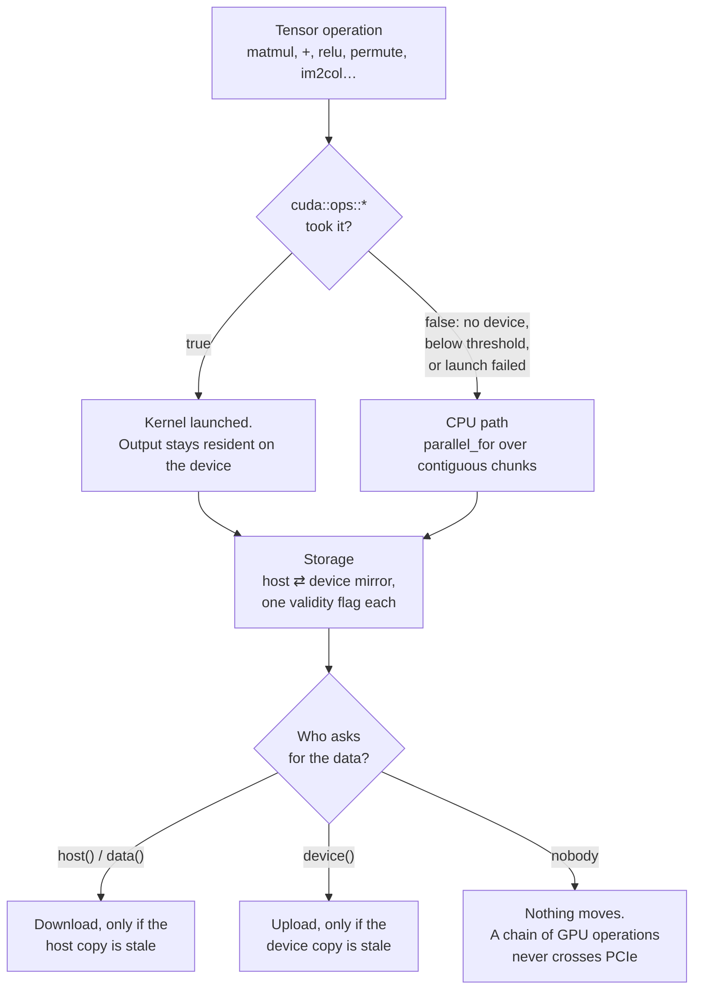
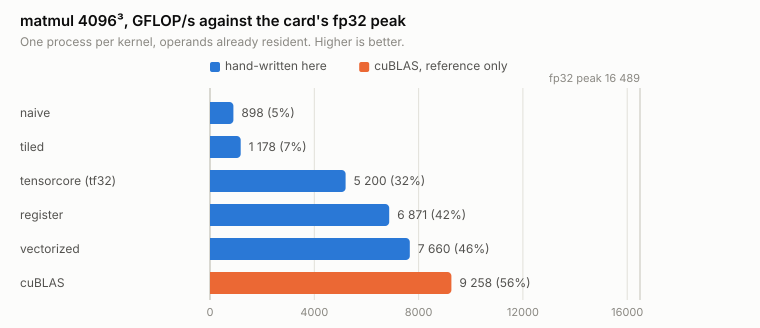

# cpp-ai-engine

A deep learning engine written from scratch in C++17 — tensors, reverse-mode
autodiff, CNNs and Transformers — with **every gradient validated against
PyTorch**.

[](https://github.com/DanielPastor05/cpp-ai-engine/actions/workflows/ci.yml)
[](https://danielpastor05.github.io/cpp-ai-engine/)


No dependencies. No BLAS. The point is to implement it, not to call it.

*Built with heavy AI assistance — [what that means, and what was mine](#how-this-was-built).*

*[Versión en español](README.es.md)*

---

## Results

| Task | This engine | Baseline | Note |
|---|---|---|---|
| **MNIST** (CNN, 60k images) | **99.35%** | — | real data, 6 epochs, ~10 min on one core |
| Shapes at random positions | **100%** (CNN, 1 683 params) | 73.3% (MLP, 1 779 params) | translation invariance |
| Interleaved 3-class spiral | **99.3%** (MLP) | 52.7% (linear) | non-linear separability |
| "Token after the marker" | **99.3%** (Transformer) | 17.5% (mean pooling) | chance is 16.7% |
| **Gradient agreement with PyTorch** | **~1e-7** | — | 23 fixtures, single ops to full blocks |
| MNIST training on 4 cores | **1.78×** (329 s vs 587 s) | 1 core | identical loss to the last digit |
| MNIST training on the GPU | **3.83×** (4.6 s vs 17.6 s) | same binary, CUDA off | RTX 3060 Ti, 2k subset, same loss curve, stock settings |
| The same run against PyTorch | **1.70× slower** (4.6 s vs 2.7 s) | PyTorch 2.11 + cuDNN, same card | fp32 both sides, TF32 off; [why](docs/PERFORMANCE.md#against-pytorch-on-the-same-card-which-is-the-number-that-counts) |
| …and on the CPU | **2.89× slower** (17.6 s vs 6.1 s) | PyTorch on oneDNN | no BLAS here, by design — and on 12 threads against its 6 |
| matmul 512³ on 4 cores | **3.08×** | 1 core | bit-identical regardless of thread count |

Each baseline is a control that *provably cannot* solve its task. If one ever
starts succeeding, the experiment is broken — not the model.

<picture>
  <source media="(prefers-color-scheme: dark)" srcset="docs/img/mnist-vs-pytorch-dark.svg">
  
</picture>

**The engine loses to PyTorch, and that is the number worth publishing.** "3.83×
faster on the GPU than on the CPU" does not say the GPU path is fast — it says
the CPU path is slow. Measured against a framework anyone can install, on the
same card and the same model: 1.70× behind, and
[docs/PERFORMANCE.md](docs/PERFORMANCE.md#against-pytorch-on-the-same-card-which-is-the-number-that-counts)
takes the gap apart with a profiler. About half of it is cuDNN choosing Winograd
for the 3×3 convolutions, which is an algorithm this engine does not implement.

---

## It writes

Every other number on this page asks you to trust the person who measured it.
This one does not: `charlm_demo` trains a character-level Transformer on **this
repository's own documentation** — around 110 000 characters, 121 distinct bytes,
nothing downloaded and no licence question — and then writes. The exact corpus
size moves whenever a document is edited, which is the point of using them and
also why no number here pins it.

Two blocks, `d_model` 96, four heads, 64 characters of context, 173 thousand
parameters. 1 500 steps, four and a half minutes on twelve CPU threads. Cross
entropy goes **8.33 → 1.97 bits per character**, against log2 of the alphabet
size for a uniform guess.

```
The engine to build-cuda-real the spay.

---

## A CI With is a matten againe apposes measured to by for this also zeros an arithmetick
allise` cuBLAS
data different and row stame transfers **, Hoisting accumulated it;
   is a tensor mit wase through is the already and indes: park each as lessim outputs:
```

That is the raw output of one run at temperature 0.8, not a chosen excerpt. It is
not sentences, and a corpus this size was never going to make sentences — but it has learned
English word shapes, Markdown headings and fences, and the vocabulary of its
corpus, from nothing but bytes. Every layer under it is in this repository.

```bash
./build/charlm_demo          # 1 500 steps
./build/charlm_demo 200      # or a short one first
```

---

## What makes this different

**Gradients are validated against PyTorch, not just against themselves.**
Numerical gradient checking proves internal consistency; it does not catch a
convention that is wrong in both the forward and the backward pass.
`tools/generate_reference.py` builds the same computation in PyTorch and
`tests/test_reference.cpp` replays it, from `matmul` to a whole
`TransformerBlock` and a 10-step Adam trajectory. Everything agrees to ~1e-7, and
the fixtures are committed so CI needs no Python.

**Performance work is measured, and the measurements often disagreed with me.** A
micro-benchmark said removing a branch from `matmul` would give 1.7×; removing it
made the Transformer 12% *slower*, because the matrices reaching it are half
zeros. The same micro-benchmark later argued for register tiling: 2.6× on dense
matrices, 4% slower end to end.

**Then five optimisations in a row failed to move the clock, and the reason was
none of them.** Element-wise operations ran at 5.5-9.5 GB/s against the 35 this
machine's memory does — not a bandwidth figure but 800 page faults per tensor.
Every operation returns a new one, so allocating and zero-filling the output was
**74% of a `relu`**. A pool of host buffers took MNIST from 25.1-26.2 s to
17.8-18.5 s without making any arithmetic faster, and the measurement that
explained five dead ends had been sitting in the performance notes for a day. All
of it, including what I discarded, is in
[docs/PERFORMANCE.md](docs/PERFORMANCE.md).

**Multi-threading that does not change the answer.** The split is by output row,
so the accumulation order never changes and results are **identical bit for bit**
whatever the thread count. The first attempt made the examples *slower*; the
thresholds come from a measured 7.8 µs dispatch cost.

**A GPU backend that does not fork the codebase.** Every CUDA operation returns a
`bool` — *true if it took the work* — so `src/tensor.cpp` gained one condition
per operation, not a second implementation. `Storage` keeps a host buffer and a
lazily-synced device mirror, so a chain stays on the GPU and only comes back when
the program reads a value, asserted by counting transfers rather than assumed.
[docs/CUDA.md](docs/CUDA.md).

**Real bugs, found and fixed.** A `shared_ptr` cycle that leaked the entire
computation graph. A repeated `backward()` that multiplied gradients. A heap
overflow AddressSanitizer caught and every test missed. Install rules that had
never been consumed from outside the repository and were broken two ways. Each is
written up with symptom, diagnosis and fix in
[docs/ENGINEERING.md](docs/ENGINEERING.md), and each has a regression test.

---

## Quick start

```bash
cmake --preset default && cmake --build --preset default
ctest --preset default                         # 534 checks
./build/mnist_demo                             # trains a CNN on real data
```

`CMakePresets.json` also carries `cuda`, `debug`, `asan` and `tsan` — the five
configurations CI builds, so reproducing a red job is one flag rather than a
remembered command line. `cmake --list-presets` shows them.

The repository ships a 2 000-image MNIST subset so this works straight after
cloning. Run `tools/download_mnist.sh` for the full 60 000 — the example detects
which one is present.

---

## What's inside

Every operation goes through one dispatch decision, and that decision is the
architecture. `cuda::ops::*` returns `bool`: **true means the device took the
work**, false sends the caller down the CPU path. There is no `#ifdef` per
operation and no second implementation to keep in sync — without CUDA the same
functions are linked from `src/cuda_disabled.cpp` returning false, and the
linker deletes them.



The invariant that makes it work: **at least one of the two copies is valid at
all times**, and nothing is transferred until somebody asks for the side that
has gone stale. That is why a `conv → relu → pool → conv` chain stays on the
card end to end, and why an operation *without* a kernel is expensive out of
proportion to its cost — it pulls its input down and forces the next one to push
it back up.

`Storage` is its own type **because it was separated before the first kernel was
written**: with a `std::vector<float>` inside `TensorImpl` there would have been
nowhere to record that a tensor was already on the card, and every operation
would have grown host/device branches. The class diagram, the `weak_ptr` that
stopped the graph leaking, and the rest of the reasoning are in
**[docs/DESIGN.md](docs/DESIGN.md)** and
**[docs/ENGINEERING.md](docs/ENGINEERING.md)**; the CUDA backend has
**[docs/CUDA.md](docs/CUDA.md)** and the profiling method
**[docs/PROFILING.md](docs/PROFILING.md)**.

Ten headers under `include/engine/`, all indexed in the
[**API reference**](https://danielpastor05.github.io/cpp-ai-engine/), regenerated
on every push to `main`.

---

## Usage and examples

```cpp
nn::Sequential model{
    nn::make<nn::Conv2d>(1, 16, nn::Window2d(3, 3, 1, 1)),
    nn::make<nn::ReLU>(),
    nn::make<nn::MaxPool2d>(2, 2),
    nn::make<nn::Flatten>(),
    nn::make<nn::Linear>(16 * 14 * 14, 10)
};
optim::Adam opt(model.parameters(), 0.001f);

opt.zero_grad();
Tensor loss = nn::cross_entropy_loss(model(X), y);
loss.backward();
optim::clip_grad_norm(model.parameters(), 5.0f);
opt.step();

engine::save_parameters(model, "model.bin");    // matched by name, shapes verified
```

Autodiff, `NoGradGuard` for inference, LR schedulers, attention with a causal
mask: [`examples/`](examples/) has one runnable program per area, all seven built
and run by CI rather than pasted here. Full signatures in the
[API reference](https://danielpastor05.github.io/cpp-ai-engine/).

```bash
./build/mnist_demo        # CNN on real MNIST digits + save/load round-trip
./build/charlm_demo       # a character-level Transformer on this repo's docs
./build/cnn_demo          # CNN vs MLP on shapes drawn at random positions
./build/transformer_demo  # attention on a task that needs word order
./build/nn_demo           # MLP on an interleaved spiral
./build/autograd_demo     # backpropagation from first principles
./build/cpp_ai_engine     # tensors, strides and matmul
```

**Attention needed no new derivatives** — it composes batched `matmul`,
`transpose`, `softmax` and an addition; what it required was generalising the
tensor to N dimensions. `transformer_demo` prints the weights it learned, one
head putting 0.94 on the position holding the answer:

```
  Head 0: 0.00  0.00  0.00* 0.00  0.14  0.74  0.11  0.02
  Head 3: 0.00  0.06  0.94* 0.00  0.00  0.00  0.00  0.00
                     ^ the position containing the answer
```

Built in six phases — tensors, autograd, layers and optimisers, CNNs,
Transformers, CUDA — each with its own demo and its own write-up in
[docs/](docs/).

---

## CUDA

The GPU backend is **off by default** — the engine has to keep compiling and
passing its 534 checks on a machine with no toolkit and no card, which is what
CI has.

```bash
cmake -B build-cuda -S . -DENGINE_CUDA=ON     # add -DCMAKE_CUDA_ARCHITECTURES=<xx>
cmake --build build-cuda --parallel
ctest --test-dir build-cuda --output-on-failure   # adds the CPU/GPU parity cases
./build-cuda/bench                                # CPU vs GPU, transfers apart
```

`matmul`, the element-wise operators, the scalar ones, `transpose` / `permute`,
per-axis sums, ReLU, softmax, `im2col` / `col2im` and `MaxPool2d` dispatch to
hand-written kernels — enough that a CNN's `conv → relu → pool → conv` chain
stays on the device end to end. Everything else stays on the CPU, and
[docs/CUDA.md](docs/CUDA.md) says which and why.

**The kernel list is a residency decision, not a checklist.** An operation
without one downloads its input and forces the next to upload it again: a
`* 1/sqrt(d_k)` between two `matmul`s was a full round trip over PCIe, and a
`TransformerBlock` step went from 29 downloads / 39 uploads to 14 / 6 once the
cheap operations in the middle stopped going through host.

**The `matmul` ships as six kernels**, all live and selectable, because the
progression is the result: textbook shared-memory tiling does 1 FMA per 2 shared
reads, and an 8×8 block of outputs per thread makes it 64 per 16.
**Measured against cuBLAS, not against itself.** 4096³, RTX 3060 Ti, operands
resident, one process per kernel:

<picture>
  <source media="(prefers-color-scheme: dark)" srcset="docs/img/matmul-kernels-dark.svg">
  
</picture>

| | `tiled` | `register` | `vectorized` | `tensorcore` (tf32) | **`tensorcore-fp16`** | cuBLAS |
|---|---|---|---|---|---|---|
| GFLOP/s | 1 178 | 6 871 | 7 660 | 5 200 | **9 176** | **9 258** |
| % of fp32 peak | 7.1% | 41.7% | 46.5% | 31.5% | **55.6%** | **56.1%** |

**46.5% of peak, 1.21× behind cuBLAS**, with the register tiling worth 5.8× over
the textbook version. cuBLAS is linked into the benchmark as the reference row
and nowhere else.

**The tf32 tensor-core kernel loses and the fp16 one does not.** Both are real
WMMA, and tf32 reaches 31.5% because on consumer Ampere dense tf32 throughput is
*the same* 16.2 TFLOP/s as fp32. Changing one thing — `__half` fragments stepping
16 along K instead of 8 — takes the same tile to **9 176 GFLOP/s, within 1% of
cuBLAS.** "The famous 2× needs fp16" stops being an argument and becomes two rows
of a table. Neither is selected automatically and neither trains anything: fp16
loses *range*, which is what loss scaling exists to manage and this engine has
none.

**And the benchmark was lying before that got sorted out.** Five kernels back to
back in one process measures temperature as much as code: the same kernel read
4 888 GFLOP/s inside the sweep and 7 660 on its own. The numbers above come from
one process per kernel, and an earlier version of this README reported the
throttled figures as fact.

**CI has no GPU**, so the kernel's index arithmetic is *replayed on the CPU* —
same grid, same threads, same shared-memory staging, same barriers, same index
expressions — against a reference product on eleven shapes chosen for their
remainders. On a machine with a card, parity is the same expression computed
twice, backend off and on, up to a `TransformerBlock` and its backward pass.

Five environment knobs, no recompilation: `ENGINE_CUDA`, `ENGINE_CUDA_MIN_FLOPS`
/ `ENGINE_CUDA_MIN_ELEMENTS`, `ENGINE_CUDA_SYNC`, `ENGINE_NUM_THREADS` and
`ENGINE_BUFFER_POOL_MB`. Kernel-by-kernel reasoning:
**[docs/CUDA.md](docs/CUDA.md)**; profiling method:
**[docs/PROFILING.md](docs/PROFILING.md)**.

---

## Testing

536 checks over nine translation units, on every push against **GCC, Clang,
AppleClang and MSVC**, plus ASan+UBSan, ThreadSanitizer, a Debug build with
library assertions, a fuzzing campaign against the weight parser, and a separate
project that installs the library and consumes it.

Three layers: **against PyTorch** (23 committed fixtures, ~1e-7); **numerical
gradient checking** against `(f(x+h) - f(x-h)) / 2h`, weighted by a non-uniform
upstream gradient so an indexing error cannot cancel itself out; and **structural
properties** — `col2im` asserted to be the exact adjoint of `im2col` through
`⟨im2col(x), y⟩ == ⟨x, col2im(y)⟩`, a `weak_ptr` proving the graph is released.

```bash
ctest --test-dir build --output-on-failure
```

---

## Using it from another project

```bash
cmake --install build --prefix /where/you/want
```

```cmake
find_package(cpp_ai_engine REQUIRED)
target_link_libraries(my_app PRIVATE engine::engine)
```

Point CMake at the prefix with `-DCMAKE_PREFIX_PATH`. **A CUDA build and a CPU
build are not interchangeable** — `ENGINE_CUDA` changes `Storage`'s layout — and
consuming one needs the toolkit findable at configure time.

Tested rather than asserted: [`tests/package/`](tests/package/) is a separate
CMake project with no path back to the source tree, and CI installs and consumes
it on every push. It exists because the install rules had been here for weeks,
never consumed from outside, and were broken two ways — a `Threads::Threads` the
config file never re-found, and 27 unresolved cudart symbols a static library has
no link line to export.

---

## API stability

The version is `0.6.0` and the leading zero is doing work: **the API is not
stable yet.** `Tensor` and its operations are settled; `nn::Module`, `optim` and
`serialize` are settled in shape, with layers added and none changing signature;
`cuda::` is additive. **`engine::detail` is not public** — `Storage` and
`cuda::ops` live in headers because the library is header-plus-static-lib, not
because anyone should call them, and they are excluded from the API reference for
that reason.

Until 1.0 a minor bump may break source compatibility. What will not happen
silently is an operation changing its numerical result: every one is checked
against PyTorch fixtures to ~1e-7, and a change that moved those numbers would
fail CI first. The weight-file format carries a version field and rejects what it
does not recognise, so a checkpoint is either read correctly or refused — never
misinterpreted.

---

## How this was built

**This engine was written with heavy AI assistance — Claude (Anthropic) — and
the history is short and dense because of it.** Every commit is authored under
my name, so `git log` will not tell you; this section is where you find out, and
it is here for exactly that reason. What follows is what was mine and what was
not.

Earlier revisions carried a `Co-Authored-By: Claude` trailer on most commits and
this paragraph pointed at it. The trailers were removed on 2 August 2026; the
disclosure was not, and moving it here rather than dropping it is the whole
point. A reader who wants the machine-readable version has this paragraph
instead.

**Mine.** The architecture and every decision that constrains it: `Tensor` as a
handle over a shared `TensorImpl`; splitting the buffer into a `Storage` with
host/device validity flags *before* writing the first kernel, because the
alternative was host/device branches spread through every operation; the
`bool`-returning dispatch contract that keeps `src/tensor.cpp` free of `#ifdef`.
The decision to validate against PyTorch instead of trusting numerical gradient
checks. Choosing what to measure, reading the measurements, and the calls that
followed from them — including killing optimisations that turned out to be
slower, and the ones recorded in [docs/PERFORMANCE.md](docs/PERFORMANCE.md) as
failures. Which of the four `matmul` kernels was worth keeping and why the
progression itself is the result.

**Not mine, or not only mine.** Most of the code as typed. The register-tiled
GEMM was written against an arithmetic-intensity argument I set out and then
verified by profiling, but I did not derive the load-index algebra by hand.
Large parts of the prose in `docs/`.

**What I claim.** That I can defend any of it. The design notes in
[docs/DESIGN.md](docs/DESIGN.md) state each decision with the alternative it
rejected, and [docs/ENGINEERING.md](docs/ENGINEERING.md) logs the bugs that were
actually hit, with the regression test each one left behind. Those two documents
are the part I would most want read.

---

## License

MIT — see [LICENSE](LICENSE).
