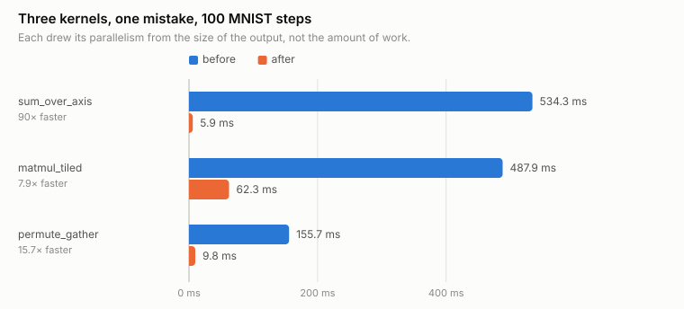

# Performance notes

Every number here was measured, on this machine, with `bench/bench.cpp` or by
profiling the examples. Where a measurement contradicted my expectation, the
contradiction is recorded rather than quietly dropped.

Reproduce with:

```bash
cmake --build build --target bench --parallel && ./build/bench
```

---

## Where the time actually goes

Profile of `transformer_demo`, built the way CMake builds it (`-O3 -DNDEBUG`):

| Function | Share |
|---|---|
| `matmul` | 53% |
| `permute` | 10% |
| `operator+` | 8% |
| `Adam::step` | 5% |
| `transpose` | 5% |
| Tensor allocation (zero fill) | 4% |

A first profile at `-O2` attributed 69% to `matmul`. That build was not the one
the project ships — see the note on baselines below.

---

## Vectorisation

Two things stopped the compiler from vectorising the hot loops.

**Aliasing.** `matmul`'s accumulator `c_row[j] += a_ik * b_row[j]` cannot be
vectorised unless the compiler knows the pointers do not overlap. Hoisting the
row pointers out of the inner loop and marking them `restrict` fixed it.

**Accessors inside the loop.** The element-wise operators called `data()` and
`size()` per element — three function calls per element — which also blocked
vectorisation. `Tensor::data()` appeared in the profile with **615 million
calls**. Hoisting the references out gave the rest.

Result: `transformer_demo` from 17.4 s to 15.9 s.

## The zero check in `matmul` stays, and it is not obvious why

```cpp
const float a_ik = a_row[k];
if (a_ik == 0.0f) continue;
```

On dense matrices this branch costs about 40%: it blocks vectorisation, and
multiplying by zero is cheaper than branching. A micro-benchmark says remove it.

The micro-benchmark is wrong for this workload. Matrices reaching `matmul` in a
real network are frequently **ReLU outputs**, with roughly half their entries at
exactly zero — the second dense layer of every Transformer block, for example.
There the branch skips half the work.

Measured on the real example rather than on synthetic data:

| Variant | `transformer_demo` |
|---|---|
| Baseline (branch, no hoisting) | 17.4 s |
| Hoisted + `restrict`, no branch | 18.7 s |
| Hoisted + `restrict`, with branch | **15.9 s** |

### The branch is also why register tiling does not pay, which took a while to see

The loop above writes into `c_row[j]`, so C is loaded from memory and stored back
on **every** iteration of `k`. For the second convolution of the MNIST model —
`(12544 x 144) x (144 x 32)` once `im2col` is done with it — that is 144 round
trips through C per output row, and about 1.5 memory operations per
floating-point operation. It is the textbook reason to tile: hold a strip of C in
registers across the whole `k` loop and touch memory once per strip.

Tiling 16 columns at a time was written, and on random dense matrices it did
exactly what the textbook says:

| shape | as written | tiled by 16 |
|---|---|---|
| conv1 `50176x9x16` | 9.2 GFLOP/s | 13.2 |
| conv2 `12544x144x32` | 21.2 | **55.3** |
| linear1 `64x1568x128` | 22.0 | **52.4** |

Then MNIST got **slower**: 22.7-23.2 s became 23.9-24.5 s over three alternating
runs of each, with the loss identical to four decimals and the test accuracy
identical to two.

The reason is the branch above. On the matrices that actually arrive — ReLU
outputs, half of them zero — the skip already avoids the round trip through C,
because skipping the `k` iteration skips the store too. So tiling has most of its
win already taken, and it still pays the cost it added: the `k` loop now runs
once per tile, re-reading A and re-testing the branch `N/16` times, which for
`linear1` is eight.

Measured on half-zero inputs, which is the workload:

| shape | as written | tiled by 16 |
|---|---|---|
| conv1 | **12.3 GFLOP/s** | 9.0 |
| conv2 | **45.4** | 37.2 |
| linear1 | **64.2** | 56.8 |

The engine keeps the untiled loop. What is worth keeping from this is that the
paragraph above it — *the micro-benchmark is wrong for this workload* — was
written about removing the branch, and then caught a completely unrelated
optimisation later, in the same way, for the same reason. The dense
micro-benchmark was not a bad measurement; it was a measurement of a matrix this
engine never sees.

---

## Broadcasting: 8.6× from removing a modulo

The broadcast loop indexed the right operand with `rhs[i % inner]`. A modulo per
element prevents vectorisation:

| | 1M elements |
|---|---|
| Plain addition | 0.56 ms |
| Broadcast addition, with modulo | 3.44 ms |
| Broadcast addition, block by block | **0.40 ms** |

Because tensors are contiguous, broadcasting over leading axes is just repeating
the trailing block, so the loop can walk blocks and index the operand directly.
It ends up faster than the plain addition, which reads more memory.

---

## Memory

| | Before | After |
|---|---|---|
| Backward pass over a `TransformerBlock` | +27.6 MB | **+1.1 MB** |
| `Conv2d` 16→16 over 32 images of 32×32 | 20 MB | **2 MB** |
| Attention weights per step | one `(B,H,S,S)` copy | none unless requested |

**Intermediate gradients are released as they are consumed.** In reverse
topological order a node's gradient is complete when reached, and once pushed to
its parents nothing reads it again. Holding them until the graph died was
costing 24×.

**`Conv2d` stores its input, not its `im2col` columns.** The columns are
`kH·kW` times larger than the input — nine times for a 3×3 kernel. Recomputing
them in the backward pass costs **+5% time for a 10× memory saving**. This is
the same trade-off PyTorch makes.

**Attention weights are opt-in** via `keep_attention(true)`. Storing a
`(B, H, S, S)` copy on every step that nobody reads during training also made
the example 5% slower.

For reference, the graph itself costs about **6×** over inference: the same
`TransformerBlock` forward pass takes 3.9 MB under `NoGradGuard` and 25 MB while
building a graph. That is inherent — activations have to be retained to
differentiate.

There is no leak: RSS is flat across 60 training iterations.

---

## CPU parallelism

`matmul` and the element-wise operators are split across a persistent thread
pool. Threads are created once and reused: creating one costs tens of
microseconds, more than many of the engine's operations, so spawning per call
would be a regression rather than an improvement.

**The split is deterministic by construction.** Each row of the output is
computed start to finish by a single thread, so no reduction crosses a chunk
boundary and the accumulation order never changes. Results are **identical bit
for bit** with one thread or with eight — asserted in the test suite, not just
claimed.

Measured on 4 cores:

| Threads | matmul 512³ | Speedup | Element-wise, 4M | Speedup |
|---|---|---|---|---|
| 1 | 18.97 ms | 1.00× | 4.60 ms | 1.00× |
| 2 | 9.87 ms | 1.92× | 2.83 ms | 1.62× |
| 3 | 7.08 ms | 2.68× | 2.86 ms | 1.61× |
| 4 | 6.16 ms | **3.08×** | 2.60 ms | **1.77×** |

Element-wise operations scale much worse, and that is expected: they are
limited by memory bandwidth, not by arithmetic. Adding cores does not add
bandwidth.

End to end on the flagship example — full MNIST, 60 000 images, six epochs:

| | Time | Test accuracy |
|---|---|---|
| 1 thread | 587 s | 99.35% |
| 4 threads | **329 s** (1.78×) | 99.35% |

The per-epoch losses are identical to the last digit across both runs, which is
the determinism guarantee holding in practice rather than in a unit test.

`Conv2d` had to be parallelised separately, because at the time it had its own
hand-written loop and did not go through `Tensor::matmul`. The first threaded
build left it alone and MNIST gained **nothing** — 589 s against 587 s — because
the convolutions dominate that workload.

### Composing `Conv2d` out of tensor operations, and what it cost

That hand-written loop is gone. `Conv2d` is now `im2col` followed by
`Tensor::matmul`, a broadcast bias, a permute and two reshapes — every one of
which already carries its own derivative and its own kernel. The layer's
hand-written `backward_fn` disappeared with it: autograd derives all three
gradients by composition. Roughly ninety lines deleted.

The point was to let the CUDA backend see convolutions at all, and it does. On
the bench shape (`Conv2d(8→16, 3×3)`, batch 16 of 16×16, forward + backward):

| | CPU | GPU |
|---|---|---|
| hand-written loop | 5.12 ms | 5.14 ms — the backend never saw it |
| composed | 6.78 ms | **2.85 ms** |

**1.8× against the original**, and the CNN chain `conv → relu → pool → conv` now
stays resident on the device end to end, which needed `im2col`, `col2im` and
`MaxPool2d` to get kernels of their own.

The honest other half: composition does **five passes over the output buffer
where the hand-written version did one**, and that is not free. Measured on the
MNIST subset shipped in the repo (2 000 images, 12 epochs):

| | Training |
|---|---|
| hand-written, CPU | **18.4 s** |
| hand-written, CUDA | 19.8 s |
| composed, CPU | 25.8 s (**+40%**) |
| composed, CUDA, default thresholds | 24.3 s |
| composed, CUDA, `ENGINE_CUDA_MIN_ELEMENTS=65536` | **19.5 s** |

So the GPU build came out slightly ahead and the CPU-only build paid 40%. The
cost was concentrated in `reshape`, which copied the whole buffer to change
nothing but the shape: two of those five passes were pure metadata changes.

**That table is the state before "Making the GPU actually win" below, kept
because the retraction is the interesting part.** `reshape` is now a view, and
after five further fixes the same subset trains in **4.3 s on the GPU against
23.5 s on the CPU**. The composed convolution is no longer the slower one; what
was slow was never the composition.

Two things measured along the way that did **not** work, recorded so nobody
repeats them. Replacing that `permute({0,2,1})` with `transpose()` — identical
semantics on a 3D tensor, and a specialised loop instead of per-element index
arithmetic — came out **5% slower**: it writes with a stride where permute writes
contiguously, and at this size the memory access pattern outweighs the
arithmetic. And giving the matrix product a kernel while `im2col` still ran on
the host was a **loss**, because the columns are `kH*kW` times the input and
uploading them costs more than multiplying them: 24.6 s against 19.0 s.

### The thresholds matter more than the parallelism

The first attempt used thresholds ten times lower and made the examples
**slower** — `transformer_demo` went from 15.9 s to 22.6 s. That example chains
many small matrix products, and each one was paying for synchronisation without
gaining anything.

Dispatching a parallel region costs about **7.8 µs with four threads**,
measured directly. The thresholds are derived from that number: a matmul is only
split above ~1M multiply-adds (~130 µs of work), so the overhead stays under 6%.
Below that it runs inline, and nested parallel regions always run inline.

The lesson generalises: for a threaded fast path, the interesting engineering is
in deciding *when not to use it*.

| Configuration | `-j1` | `-j4` |
|---|---|---|
| Baseline | 23.4 s | 10.1 s |
| Unity build | 17.7 s | 11.1 s ✗ |
| Precompiled headers | 32.6 s ✗ | 14.2 s ✗ |
| Header pruning + split test suite | 28.2 s | **8.7 s** |

**Unity builds and precompiled headers both make the parallel build slower** at
this project's size — unity reduces available parallelism, and PCH is generated
once per target and never amortises across six of them. Both were measured and
discarded.

What worked: `engine/tensor.hpp` is included by everything, so it carries only
what the declaration of `Tensor` needs (0.64 s → 0.34 s per translation unit).
`<random>` lives in `engine/random.hpp` and `TensorImpl` in `engine/detail/`.
The test suite was one 4.78 s translation unit — 25% of all compilation work and
the critical path — and is now split by area.

The serial build got *slower*, because each new translation unit pays for the
headers again. The parallel build is the one that matters, and the README
recommends `--parallel` accordingly.

Incremental rebuild after touching one test file: **5.2 s → 2.6 s**. That is the
number that matters day to day.

---

## End-to-end: MNIST

The full 60 000-image training set, six epochs, single-threaded:

| Epoch | Loss | Test accuracy | Elapsed |
|---|---|---|---|
| 1 | 0.2078 | 98.17% | 107 s |
| 3 | 0.0449 | 98.97% | 299 s |
| 6 | 0.0205 | **99.35%** | 587 s |

Roughly 1.6 ms per image for a forward and backward pass through a 207 000-parameter
CNN, on one CPU core with no BLAS. That is the number Phase 6 has to beat.

---

## Making the GPU actually win

For a long stretch this backend was well built and pointless: 620 parity checks,
four matmul variants, gradients verified against the CPU bit for bit — and MNIST
trained **slower with a card than without one**, 19.5 s against 18.4.

It now trains in **4.3 s against 23.5 s: 5.5×**, on the same 2 000-image subset,
same twelve epochs, same final accuracy (94.4% against 94.6%, and the loss curves
agree to four decimals) — and with no environment variables set, which was not
true of any measurement in this document before it. One training step, batch 64,
went from 40.2 ms to 9.99 ms while the CPU stayed at 69.9.

What is worth reading here is not the number, it is that **the first two things I
was sure were the cause were not**.

### The 606 MiB that did not matter

The obvious culprit was PCIe traffic. `src/optim.cpp` dispatched to the backend
zero times, so every step read `p.data()` and `grad.data()` for all 206 922
parameters — a full download and upload each, **606 MiB per training run from the
optimiser alone**. Adding `sgd_step`/`adam_step` kernels, device-side reductions
for `clip_grad_norm`, and fixing a duplicated broadcast loop in `operator+` cut
transfers per step from 6.22 MiB to 1.62.

Training time fell **2%**.

Transfers were real and worth removing, but MNIST at this size was never
transfer-bound. Instrumenting the step per phase said so immediately: forward
9.2 ms, backward 30.1, and 11 transfers totalling under 2 MiB between them.

### The profiler disagreed with all of it

`nsys` on 100 steps, and three kernels held **93.5%** of GPU time:

| kernel | share | calls | mean |
|---|---|---|---|
| `sum_over_axis` | 42.4% | 200 | 2.67 ms |
| `matmul_tiled` | 38.7% | 900 | 542 µs |
| `permute_gather` | 12.4% | 800 | 195 µs |

<picture>
  <source media="(prefers-color-scheme: dark)" srcset="img/kernel-fixes-dark.svg">
  
</picture>

All three had the **same bug**, and it is not a bug you find by reading the
kernels — each one is correct, and each looks reasonable in isolation. They all
draw their parallelism from the size of the **output** rather than the amount of
work:

- `sum_over_axis` gives one thread per output. A convolution's bias gradient has
  one output per channel: **16 threads** looping 50 176 times each. Fixed with a
  block per output and a shared-memory tree — 534 ms to 5.9 ms, **90×**.
- `matmul_tiled` gives one block per output tile. A convolution's weight gradient
  is `(9 × 50176) × (50176 × 16)`: **one block** walking a K of fifty thousand.
  Fixed with split-K, chunk count fixed on the host so the result does not shift
  between runs — 488 ms to 62 ms, **7.9×**.
- `permute_gather` reads at whatever stride the permutation implies. For the one
  permutation this engine leans on — Conv2d turning `(N·oH·oW, C)` into
  `(N, C, oH·oW)` — that stride is the channel count, so consecutive threads land
  64 bytes apart and every 32-byte sector fetched carries four useful bytes.
  33 GB/s on a card that does about 400. Fixed by detecting the last-two-axes
  swap and staging a tile through shared memory — 154 ms to 9.8 ms, **15.7×**.

Total GPU time across the run: 1 259 ms to 159 ms.

The step went from 40.2 ms to 32.2.

### Where it actually was

159 ms over 100 steps is **1.6 ms of kernel time in a 32 ms step**. Ninety-five
per cent of a "GPU-accelerated" step was the host, and not doing anything
interesting: `Storage(count, 0.0f)` allocated and zeroed a host mirror for every
tensor an operation produced, immediately before a kernel overwrote all of it.

One MNIST step creates **89 MiB** of those mirrors. Timed on its own: **20.4 ms**.

Making the host allocation lazy — `count` and `fill` describe the buffer,
`materialise()` builds it the first time anyone reads it — took the step to
**9.99 ms**. A tensor that is only ever written and read by kernels now allocates
no host memory at all.

<picture>
  <source media="(prefers-color-scheme: dark)" srcset="img/step-breakdown-dark.svg">
  
</picture>

| | step, batch 64 |
|---|---|
| CPU | 69.9 ms |
| GPU, before any of this | 40.2 ms |
| + three kernel parallelism fixes | 32.2 ms |
| + lazy host mirror | **9.99 ms** |

### What every kernel costs the scheduler

`bench/bench_kernels.cpp`, RTX 3060 Ti. Occupancy is the ceiling, not what a
launch achieves — how many blocks *fit* on an SM, which is how much latency the
hardware can hide. From `cudaFuncGetAttributes` and
`cudaOccupancyMaxActiveBlocksPerMultiprocessor`, which are plain runtime calls;
`ncu` reports the same numbers and wants administrator rights for its counters,
which is why this project had none of this until now.

| kernel | threads | registers | shared | blocks/SM | occupancy | limited by |
|---|---|---|---|---|---|---|
| `matmul_tiled` | 1024 | 40 | 8 KB | 1 | 67% | registers |
| `matmul_register_tiled` | 256 | 120 | 8 KB | 2 | **33%** | registers |
| `matmul_tensor_core` | 256 | 200 | 32 KB | 1 | 17% | registers |
| `transpose_tiled` | 256 | 26 | 4 KB | 6 | 100% | threads per SM |
| `sum_over_axis_blocked` | 256 | 37 | 1 KB | 6 | 100% | registers |
| `col2im_scatter` | 256 | 56 | — | 4 | 67% | registers |
| element-wise | 256 | 30–36 | — | 6 | 100% | threads per SM |

**The 33% row is the interesting one, and it is not a defect.** The register-tiled
GEMM holds an 8×8 block of outputs per thread — that is the whole optimisation,
64 FMAs per 16 shared-memory reads instead of 1 per 2 — and 120 registers is what
that costs. Two blocks per SM is the price of the arithmetic intensity that makes
it 5.8× faster than the tiled version. Low occupancy chosen deliberately is a
different thing from low occupancy discovered afterwards, and until this table
existed there was no way to tell which one this was.

The `limiter` column is a deduction rather than a reported field: the runtime
says how many blocks fit, not what stopped it there, so each candidate ceiling is
computed and whichever binds first is named. "33% occupancy" is not actionable;
"33%, limited by registers" names the knob.

### The allocator was giving the memory back

Extending the roofline from the one matrix product to the other twenty-five
kernels — `bench/bench_kernels.cpp` — produced a table where every element-wise
operation ran at 9–13% of the card's bandwidth. Six kernels that simple cannot
all be bad.

They were not. A 16.7M-value addition took 3.5 ms of wall clock around a kernel
`nsys` times at **0.48 ms**: 200 MB moved in 0.48 ms is 417 GB/s, **93% of the
card's 448**. The kernel was near perfect and three milliseconds were going
somewhere else, at a size where a fixed overhead should not have mattered.

`cudaMemPoolAttrReleaseThreshold` defaults to **zero**, which means *hand every
free block back to the operating system at the next synchronisation*. An engine
synchronises to read a result, so every output buffer was being returned to the
driver and re-acquired on the next operation — a cost that grows with the buffer,
which is why it hid at small sizes and dominated at 64 MiB.

Setting it to never-release:

| 16.7M-value addition | |
|---|---|
| before | 3.50 ms |
| after | **0.503 ms** |
| the kernel itself, from `nsys` | 0.480 ms |

The engine's share of the operation went from 3 ms to **23 µs**, and the
element-wise rows went from 40 GB/s to 400 — 89% of peak. MNIST went from 4.7 s
to 4.0.

**PyTorch does the same thing.** `c10/cuda/CUDAMallocAsyncAllocator.cpp` sets
`cudaMemPoolAttrReleaseThreshold` to `UINT64_MAX`, citing the same NVIDIA note on
retaining memory in the pool. That was found afterwards, looking for somewhere to
report the finding as a bug, and it is the only place in this document where a
decision is corroborated by an implementation nobody here wrote. It also closes
the question the finding raises: the reference framework has known for years, and
the default is still zero.

(There was no bug to report. `ggml` and `llama.cpp` do not use `cudaMallocAsync`
at all — they carry their own pool over the virtual-memory API.)

Two things about this are worth more than the speedup. The first is that a
comment in `src/cuda/runtime.cu` had already tried this and recorded it as worth
6% and not worth setting; that measurement never synchronised between
iterations, so the block was never released and there was nothing for the
threshold to change. **The benchmark was measuring a case the engine never
runs.** The second is that the bad table is what found it: publishing "9% of
peak" for six kernels was so obviously wrong that it had to be chased, and a
single roofline for a single matmul had hidden it for the whole project.

### The thresholds could not express the thing that mattered

One more measurement, and it undid a premise the engine had carried since the
first kernel. `ENGINE_CUDA_MIN_ELEMENTS` defaults to 2^20 — and MNIST's largest
tensor is 802 816 values, so **not one elementwise operation was dispatching**.
The chain broke after every matmul. With the threshold forced down by hand the
subset trained in 3.4 s; on stock settings, 15.8.

Retuning the constant is the obvious answer and it is the wrong one, because a
size threshold answers the question "is this worth moving the data across PCIe?"
and that question does not apply when the data is **already there**. Then
refusing is what costs the round trip, since the CPU path has to pull the buffer
down. Lowering the number for MNIST also made `transformer_demo` worse — 28 s to
39 — because its matmuls are small and genuinely not worth a launch.

So the rule became residency, which is what the optimiser kernels had been using
all along: dispatch if the input is already on the device, **or** if it is big
enough to be worth the transfer. Both demos improved at once, from the same
change, with no environment variables:

| | before | after |
|---|---|---|
| MNIST, stock settings | 15.8 s | **4.3 s** |
| `transformer_demo`, stock settings | 28.0 s | **26.0 s** |
| `transformer_demo`, thresholds forced low | 39.0 s | — |

For `matmul` the condition is that **both** operands are resident, not either:
with one side on the host it would trade a download for an upload rather than
avoid one. In a training loop both is the normal case, because the weights stay
on the device between steps once the optimiser updates them there.

### Against PyTorch, on the same card, which is the number that counts

Everything above compares the engine to itself. "5.5× faster on the GPU than on
the CPU" does not say the GPU path is fast — it says the CPU path is slow, and a
reader has no way to calibrate it. So `tools/bench_pytorch.py` trains the same
network on the same card: same subset read from the same IDX files, same two
3×3 convolutions, same dropout, same Adam at 1e-3 with cosine annealing to 1e-4,
same batch of 64, same twelve epochs, same 206 922 parameters.

TF32 is switched **off** by default there, and that matters: Ampere routes fp32
matmuls through the tensor cores at a 10-bit mantissa unless told not to, and the
engine is fp32 everywhere. Leaving it on would be comparing precisions and
calling the difference a speedup. The row is measured anyway, because it is what
a PyTorch user actually gets.

Best of three, alternating runs so thermal drift cannot favour either:

Machine: Ryzen 5 5500 — **6 physical cores, 12 logical** — and an RTX 3060 Ti.
The two CPU rows use different thread counts because each side takes its own
default: the engine asks for `hardware_concurrency` and gets 12, PyTorch asks for
the physical core count and gets 6. That asymmetry was checked rather than
assumed — at six threads the engine takes 27.0 s against 23.9 at twelve, so
twelve is genuinely its better configuration and the row is its best number.
**It ran on twice the threads and still lost by 4.55×.**

| | training | GPU kernel time per step | behind PyTorch |
|---|---|---|---|
| engine, CPU (12 threads) | 24.1 s | — | **4.55×** |
| PyTorch, CPU (6 threads) | 5.30 s | — | — |
| engine, CUDA | 4.0 s | 1.53 ms | **1.90×** |
| **PyTorch, fp32** | **2.10 s** | **0.65 ms** | — |
| PyTorch, TF32 | 1.90 s | — | 2.11× |

**The engine is 1.90× slower than PyTorch on the GPU.** That is the honest
headline, and it is a better one than the CPU comparison because it can be
checked.

The CUDA row was 2.24× when this section was first written. What closed the gap
is one attribute on the memory pool, and it is written up under "The allocator
was giving the memory back" below — the analysis of *where* the remaining time
goes was done at 4.7 s and holds, since the fix removed host cost and touched no
kernel.

The CPU row is the more uncomfortable one — **4.55× behind** — and it is worth
putting next to the other because of what the pair says. PyTorch's CPU path is
oneDNN with hand-written AVX kernels; this engine has no BLAS by design and
leans on the autovectoriser, and it pays 4.55× for that. Its CUDA path, written
from nothing against the same cuDNN it is being measured against, pays 1.90×.
**The hand-written kernels closed more of the gap than the hand-written CPU code
did**, which is not the result I expected to be able to write down.

Where the gap goes, from `nsys` on both:

**Roughly half of it is one algorithm the engine does not have.** PyTorch's
profile is led by `_5x_cudnn_ampere_scudnn_winograd_128x128` — cuDNN picking a
**Winograd** convolution for the 3×3 layers. Winograd F(2×2, 3×3) computes four
outputs with 16 multiplications where the direct form needs 36, and the engine's
im2col + GEMM is the direct form. It also never materialises the columns:
`im2col_gather` and `col2im_scatter` write a matrix nine times the size of the
input, twice per layer per direction, and cuDNN's implicit-GEMM and Winograd
paths skip that entirely.

**The other half is per-operation host cost, and both frameworks pay it.** The
engine spends 1.53 ms of a 9.16 ms step inside kernels — **17%**. PyTorch spends
0.65 ms of about 5.5 ms — **12%**. Neither is GPU-bound at this size; MNIST at
batch 64 is a workload where dispatch overhead dominates arithmetic for
*everybody*, and the framework with the leaner Python-to-kernel path wins. That
the engine, written from scratch in a weekend's worth of sessions, sits within
1.90× of that is the real result — not the 6×.

One engine kernel stands out as addressable rather than algorithmic:
`grad_accumulate` is 13.5% of GPU time across **1 501 launches per 100 steps**,
because every gradient accumulation is its own kernel. PyTorch fuses that into
the backward operations. That is a fusion problem, not a Winograd problem, and
it is the cheapest of the remaining gaps.

Peak device memory, PyTorch: 76.7 MiB. The engine does not track it, which is a
gap in the instrumentation rather than a result.

To reproduce the whole table:

```bash
python -m venv .torch
.torch/bin/pip install torch --index-url https://download.pytorch.org/whl/cu128
.torch/bin/python tools/bench_pytorch.py          # matched: fp32, no TF32, no cuDNN autotune
.torch/bin/python tools/bench_pytorch.py --tf32   # what PyTorch gives you by default
./build-cuda/mnist_demo                           # the engine, same model, same data
```

Alternate the two rather than running one three times: a sustained GPU load
drifts by more than the difference being measured. That is not a hypothetical —
it is written up under "The thresholds matter more than the parallelism" above,
and it once made this project record a 3× regression that did not exist.

The charts come from `python tools/plot_benchmarks.py`, which writes
`docs/img/*.svg` — one light file and one dark file each, no dependencies beyond
the standard library.

### The numbers check themselves

Everything above was, until recently, asserted by the person who measured it and
verified by nobody — and the numbers lived in four files, copied between them by
hand. Both ways that fails had already happened here: a stale `6.92×` survived in
the README for several commits after the honest number became 5.47×, and
`docs/CUDA.md` said the best kernel was "1.94× behind cuBLAS" in one paragraph
and 1.21× in its own table, forty lines apart, for weeks.

`docs/performance.json` is now the source, and two checks read it.

**`tools/claimcheck.py` runs in CI and blocks.** Every claim must appear in each
file that cites it; no retired number may appear anywhere except where the
retraction is deliberate and registered; and a ratio must equal the two numbers
it comes from. It measures nothing — text against data on a checkout, so there is
nothing in it to flake.

It started here and now lives on its own at
[claimcheck](https://github.com/DanielPastor05/claimcheck), because the idea
turned out to be more general than the engine: any project that publishes
measured numbers in more than one file has this problem. The copy in `tools/` is
vendored, one standard-library file, so CI needs no network.

**`tools/check_perf.py` re-runs the benchmarks** and compares them against the
same file. It is deliberately *not* in CI: a shared virtualised runner with no
GPU cannot hold a timing threshold, and a performance test that fails at random
teaches people to ignore a red CI, which is worse than not having one.

Its tolerances come from spreads this document already records rather than from
whatever makes a run pass — 30% on GPU wall clock, because the sweep above is
thermally biased by up to 1.6× and the tf32 row measured 1.9 s cold and 2.5 s
warm on the same build the same afternoon; 25% on CPU wall clock; 10% on the
isolated matmul rows, which is what the one-process-per-kernel harness buys.

And it will not fail on **uniform** drift. A regression in one of this engine's
kernels cannot also slow PyTorch down, so when every row moves the same way the
finding is about the machine, not the code, and it says so instead. What still
fails is one row moving while its neighbours do not, which is what a real
regression looks like.

### What this cost to find

Three measurements, in this order, each of which contradicted the plan:

1. Transfer counters per phase — killed the PCIe hypothesis the plan was built on.
2. `nsys` per-kernel times — found three unrelated-looking kernels with one shared
   design mistake.
3. A twelve-line micro-benchmark of `std::vector::assign` — found the thing that
   was bigger than all three kernels put together.

None of them needed a tool that was not already installed. The first two
hypotheses were mine and both were wrong; what made the difference was measuring
before each change rather than after.

`ncu` wants administrator rights for its performance counters on Windows.
`nsys profile -t cuda` does not, and per-kernel totals were all this needed.

---

## A note on baselines

An early benchmark showed a 4.4× speedup from `-O2` to `-O3` on `matmul`. Before
recommending it, I checked what the project actually compiles with: CMake's
`Release` configuration already passes `-O3 -DNDEBUG`. The speedup was an
artefact of the benchmark command, not an improvement available to the project.

Verify the baseline is the real one before quoting an improvement against it.

---

## GPU

The CUDA backend, its design and how to reproduce its measurements are in
**[docs/CUDA.md](CUDA.md)**. Two things worth repeating here:

- The transfer cost is measured and reported **separately** from kernel time.
  On a real engine the PCIe link becomes the bottleneck long before arithmetic
  does, and a CPU/GPU table that folds that cost into the total says nothing
  about the engine — it says how big the matrix was.
- `Conv2d` **does** go through the GPU now. It used to have its own hand-written
  loop and never called `Tensor::matmul`; it is now composed out of `im2col`,
  `matmul` and `permute`, which is what let the whole CNN chain get kernels.

---

## What is deliberately not done

- **No BLAS.** The point is to implement it, not to call it. On the shapes the
  MNIST model produces, `matmul` reaches 45-64 GFLOP/s across twelve threads on
  the inputs it really gets; a tuned BLAS still does better, and does it on dense
  matrices too.
- **No cache tiling in `matmul`, and no register tiling either.** The second was
  written and measured: 2.6× on dense matrices, 15-20% *slower* on the half-zero
  ones a real network produces, and 4% slower end to end. The section on the zero
  check above has the numbers. Cache tiling was never written, and the profile
  argues against it for a different reason than the one first given here: the one
  shape with a B that does not fit in L2 — `linear1`, 784 KB — is the *fastest*
  of the four at 64 GFLOP/s, because M is 64 and the whole product is 0.4 ms.
- **No `-march=native` or `/arch:AVX2`.** This used to say "worth another 1.4×".
  It is not, on this workload: the engine was rebuilt with `/arch:AVX2` and
  measured against the baseline in alternating runs, and the two are
  indistinguishable — conv2 came out at 18.4-20.2 GFLOP/s without it and
  19.1-21.8 with it, inside a run-to-run spread wider than the difference. A loop
  bound by L1 traffic does not care how wide the registers are. The portability
  cost is real and now there is nothing on the other side of it.
- **Views for `transpose` and `permute`.** `reshape` is a view now; those two
  are not, and stay that way deliberately. They genuinely move data, and making
  them views means non-contiguous strides through every kernel and every CPU
  loop — a different project, with no payoff measured here.

## Where a CPU step actually goes, since the above is mostly about what it is not

Measured on the MNIST model at batch 64, twelve threads, forward only:

| | ms | |
|---|---|---|
| `Conv2d(1->16)` | 6.36 | of which `im2col` 0.83, `matmul` 1.17 |
| `ReLU` | 1.19 | |
| `MaxPool2d` | 1.38 | |
| `Conv2d(16->32)` | **11.63** | of which `im2col` 4.75, `matmul` 2.54 |
| `ReLU` | 0.51 | |
| `MaxPool2d` | 0.88 | |
| `Dropout` | 1.35 | on 100 352 elements, and see `nn.cpp` for why it is serial |
| `Linear(1568->128)` | 0.60 | |
| `Linear(128->10)` | 0.05 | |
| **total** | **23.94** | a full step is ~67 ms: 24 forward, 41 backward, 0.8 Adam |

Two things fall out of this, and neither is the matrix product.

**The convolutions are 75% of the forward, and a third of each one is neither
`im2col` nor `matmul`.** What is left is the `reshape → permute → reshape` that
puts the product back into `(N, C, H, W)`; `permute` materialises, by the
deliberate choice three bullets up, and for the first convolution that is 3.2 MB
moved with strided index arithmetic.

**Element-wise operations run at 5.5-9.5 GB/s** on `(64,16,28,28)` — `relu` 1.16
ms, `add` 1.02, a scalar multiply 0.97 — against dual-channel DDR4 that does
roughly 35. That is the floor under every activation, and it is a quarter of the
hardware.

Neither has been acted on. They are recorded here because the measurement exists
and pointing at the wrong thing for a while is the expensive part.
